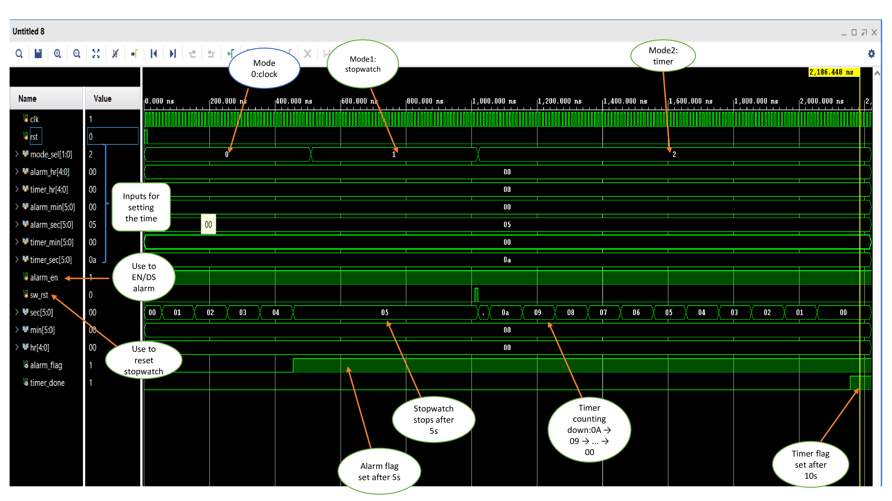

# -digital-clock-verilog

# Digital Clock with Multiple Modes

This is a Verilog-based digital clock system that supports:
- 🕒 Clock Mode
- ⏱️ Stopwatch Mode (counts up from 0 and stops at 5s)
- ⏳ Timer Mode (counts down from 10 to 0)
- ⏰ Alarm Mode (logic prepared)

## Tools Used
- Vivado
- Verilog HDL

## Author
Shubham [LinkedIn](www.linkedin.com/in/shubham-tayade-112189280)

## Simulation

## 🧠 RTL Schematic

